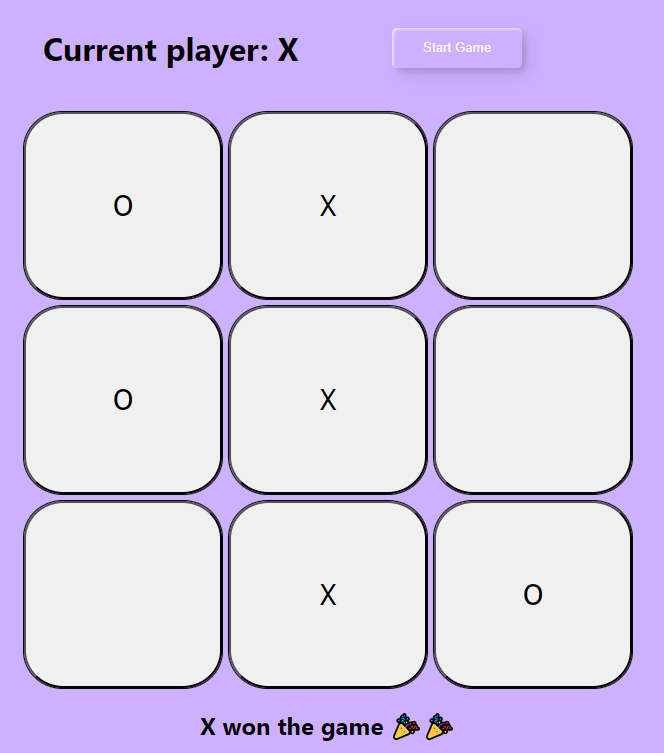

# Tic Tac Toe

A simple tic tac toe game using Angular. The purpose of this project is to exercise logic by creating a very simple game. It helps to visualize components and practice directives.

This project was generated with [Angular CLI](https://github.com/angular/angular-cli) version 17.1.1.

## Development server

Run `ng serve` for a dev server. Navigate to `http://localhost:4200/`. The application will automatically reload if you change any of the source files.

## Running unit tests

Run `ng test` to execute the unit tests via [Karma](https://karma-runner.github.io).
